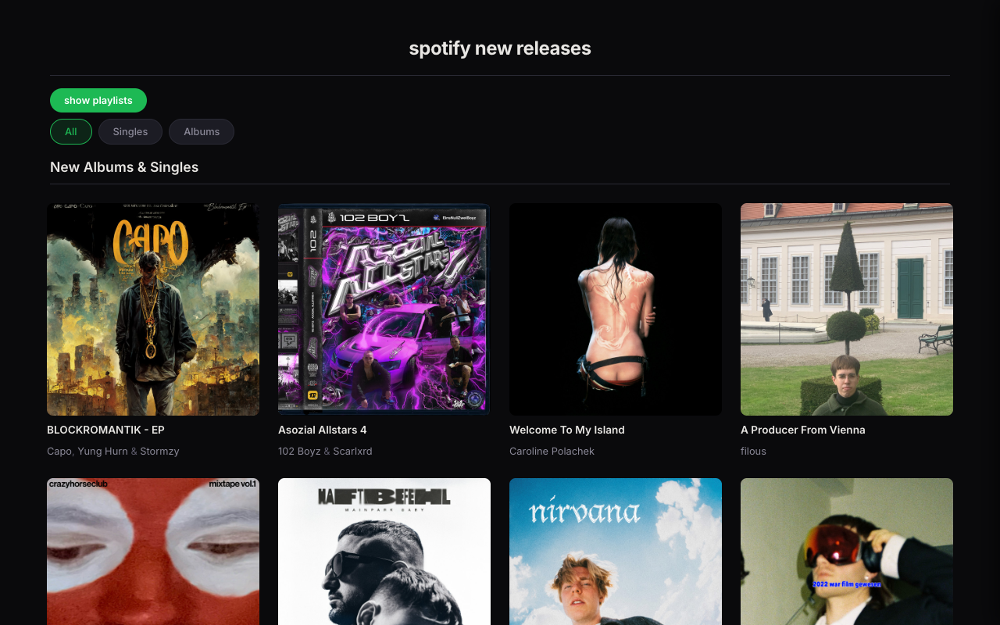

# music releases

browse new albums and singles from spotify — a react app rendering 50 releases from static JSON data, with filtering, album detail overlays, and a playlist sidebar.

## why

the original project explored react component composition and data-driven UI — mapping over album objects, conditional rendering, and responsive layout. the glow-up refined the visual layer: CSS custom properties, active filter states, css grid replacing flexbox hacks, and a cleaner sidebar.

## how it works

- **filter by type** — all, singles, or albums with visual active state
- **album hover overlay** — play, favorite, more, and info buttons appear on cover hover
- **info toggle** — click ℹ️ to reveal release date and track count
- **playlist sidebar** — slides in from the right with 10 editor's picks, closes on outside click
- **responsive grid** — 4 columns → 2 → 1 across breakpoints

## screenshot



## stack

`react` · `vite` · `javascript` · `css custom properties` · `css grid` · `spotify data`

## run locally

```bash
npm install
npm run dev
```

## status

🟢 shipped — originally a Technigo bootcamp project, redesigned with Spotify-green accent and polished UI

---

<sub>built by fabio cassisa · paired with [carl öberg](https://github.com/Calleobe)</sub>
